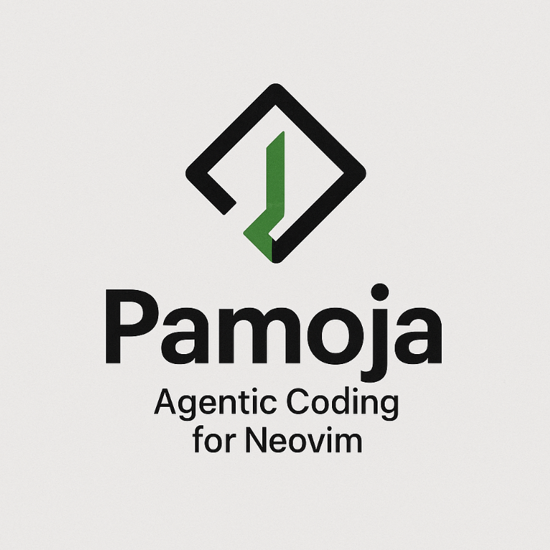

<p align="center">
  
</p>

<h1 align="center">Pamoja</h1>

<p align="center">
  <strong>Pamoja</strong> (Swahili for "together") — a dual-agent agentic workflow plugin for Neovim with Claude Code and Gemini CLI support.
</p>

## Why "Pamoja"?

The name reflects the core philosophy of this plugin: **working together**. Rather than being locked into a single AI provider, Pamoja brings multiple agents together under one unified interface. Claude and Gemini work alongside each other — and alongside you — as collaborative partners in your coding workflow.

- **Together with your editor**: Seamless Neovim integration
- **Together across providers**: Switch between Claude and Gemini instantly
- **Together on complex tasks**: Multi-step workflows that coordinate agent capabilities

One interface. Multiple agents. Working *pamoja*.

## Features

- **Dual Provider Support**: Seamlessly switch between Claude Code and Gemini CLI
- **Ask Agent**: Get answers to coding questions with full context
- **Code Refactoring**: Apply structured refactors with diff preview
- **Code Generation**: Generate new code into buffers
- **Multi-File Operations**: Plan and execute cross-file changes safely
- **Streaming Output**: See responses as they arrive

## Requirements

- Neovim >= 0.9.0
- One or both of:
  - [Claude Code CLI](https://docs.anthropic.com/en/docs/claude-code) installed and authenticated
  - [Gemini CLI](https://github.com/google-gemini/gemini-cli) installed and authenticated

## Installation

> **See the [Wiki](https://github.com/swmcc/agentic.nvim/wiki) for detailed setup guides:**
> - [LazyVim Setup](https://github.com/swmcc/agentic.nvim/wiki/LazyVim-Setup) - Local development and testing

### lazy.nvim

```lua
{
  "swmcc/pamoja.nvim",
  config = function()
    require("pamoja").setup({
      default_provider = "claude",
    })
  end,
}
```

### packer.nvim

```lua
use {
  "swmcc/pamoja.nvim",
  config = function()
    require("pamoja").setup({
      default_provider = "claude",
    })
  end,
}
```

## Configuration

```lua
require("pamoja").setup({
  -- Default AI provider: "claude" or "gemini"
  default_provider = "claude",

  -- Provider-specific settings
  providers = {
    claude = {
      cmd = "claude",
      args = {},
    },
    gemini = {
      cmd = "gemini",
      args = {},
    },
  },

  -- UI settings
  ui = {
    output = "split",           -- "split" | "float" | "tab"
    split_direction = "below",  -- "below" | "above" | "left" | "right"
    split_size = 15,
    confirm_changes = true,
  },

  -- Optional keymaps
  keymaps = {
    ask = "<leader>pa",
    summarize = "<leader>ps",
    refactor = "<leader>pr",
    generate = "<leader>pg",
    task = "<leader>pt",
  },
})
```

## Commands

| Command | Description |
|---------|-------------|
| `:PamojaAsk [prompt]` | Ask the agent a question |
| `:PamojaSummarize` | Summarize selected text (visual mode) |
| `:PamojaRefactor [instruction]` | Refactor selected code |
| `:PamojaGenerate [description]` | Generate new code |
| `:PamojaTask [description]` | Run a multi-step task |
| `:PamojaUse {provider}` | Switch to claude or gemini |
| `:PamojaStatus` | Show current provider status |
| `:PamojaCancel` | Cancel running operation |

## Usage Examples

### Ask a Question

```vim
:PamojaAsk How do I implement binary search in Lua?
```

### Summarize Selection

```vim
" Select code visually, then:
:'<,'>PamojaSummarize
```

### Refactor Code

```vim
" Select function, then:
:'<,'>PamojaRefactor Extract the loop into a separate function

" Or refactor entire file:
:PamojaRefactor Add error handling to all functions
```

### Generate Code

```vim
:PamojaGenerate Create a Lua module for parsing CSV files
```

### Multi-File Task

```vim
:PamojaTask Rename the User class to Account across the codebase
```

### Switch Provider

```vim
:PamojaUse gemini
:PamojaStatus
```

## Architecture

See [ARCHITECTURE.md](./ARCHITECTURE.md) for detailed technical documentation.

## MVP Scope

See [MVP.md](./MVP.md) for current feature scope and roadmap.

## License

MIT

## Contributing

Contributions welcome. Please open an issue first to discuss proposed changes.
